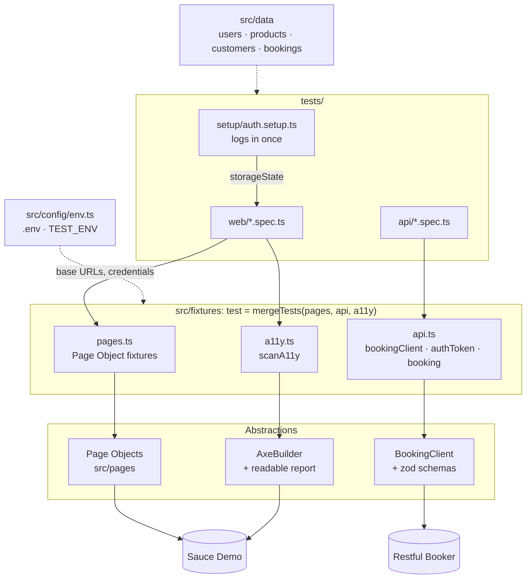
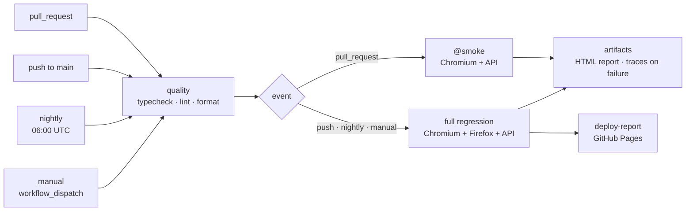

# Playwright Web & API Automation

[](https://github.com/katherine-chavez-qa/playwright-web-api-automation/actions/workflows/playwright.yml)
[](https://katherine-chavez-qa.github.io/playwright-web-api-automation/)

Test automation framework for **web UI, REST API and accessibility** testing, built with **Playwright** and **TypeScript**. It uses the Page Object Model, custom fixtures and schema validation, and runs on GitHub Actions with smoke tests on pull requests, a full regression on `main` and a nightly run.

📊 **Latest test report:** <https://katherine-chavez-qa.github.io/playwright-web-api-automation/>
(published from every push to `main`, the nightly run and manual runs)

## Test coverage

| Area               | Target                                                 | What is tested                                                                                       | Tests         |
| ------------------ | ------------------------------------------------------ | ---------------------------------------------------------------------------------------------------- | ------------- |
| Web: login         | [Sauce Demo](https://www.saucedemo.com)                | Valid user, locked-out user, invalid credentials, required username                                  | 4 per browser |
| Web: cart          | Sauce Demo                                             | Add products, list them in the cart, remove from inventory and from the cart page                    | 4 per browser |
| Web: checkout      | Sauce Demo                                             | End-to-end purchase with totals verification; data-driven validation of required fields              | 4 per browser |
| Web: sorting       | Sauce Demo                                             | Data-driven: name A→Z, Z→A, price low→high, high→low                                                 | 4 per browser |
| Accessibility      | Sauce Demo                                             | WCAG 2.2 A/AA on login, inventory and checkout, including error states                               | 5 (Chromium)  |
| API: bookings      | [Restful Booker](https://restful-booker.herokuapp.com) | Health check, create, get, list, PUT, PATCH, DELETE, 404, with response schema validation            | 8             |
| API: auth          | Restful Booker                                         | Token for valid credentials, rejection of invalid ones                                               | 2             |
| API: authorization | Restful Booker                                         | PUT / PATCH / DELETE without a token or with an invalid token → 403, and the booking stays unchanged | 6             |

Web tests run on **Chromium and Firefox**. **54 tests per full run**: 32 web, 5 accessibility, 16 API and 1 auth setup.

| Tag           | Purpose                                                | Tests |
| ------------- | ------------------------------------------------------ | ----- |
| `@smoke`      | Critical paths: login, checkout, API health and create | 6     |
| `@regression` | The whole suite (every `describe` is tagged)           | 53    |
| `@a11y`       | Accessibility checks                                   | 5     |

## Architecture



- **Specs** describe behavior only; they never build page objects or HTTP calls themselves.
- **Fixtures** inject what each test asks for. They are lazy, so API tests never launch a browser.
- **Page Objects, `BookingClient` and `AxeBuilder`** hold locators, endpoints and scan rules.
- **`env.ts`** is the only place that reads environment variables.

## Run locally

Requirements: **Node.js 24** (see `.nvmrc`).

```bash
npm ci
npx playwright install chromium firefox
npm test
```

| Script                    | What it does                                      |
| ------------------------- | ------------------------------------------------- |
| `npm test`                | Whole suite on every project                      |
| `npm run test:smoke`      | Only `@smoke` tests                               |
| `npm run test:regression` | Only `@regression` tests                          |
| `npm run test:a11y`       | Only `@a11y` tests                                |
| `npm run test:web`        | Web projects (Chromium + Firefox)                 |
| `npm run test:api`        | API project                                       |
| `npm run test:ui`         | Playwright UI mode                                |
| `npm run report`          | Open the last HTML report                         |
| `npm run typecheck`       | TypeScript type check                             |
| `npm run lint`            | ESLint (type-aware rules + Playwright plugin)     |
| `npm run format`          | Format with Prettier (`format:check` only checks) |

Tags and projects can be combined, for example smoke on Chromium only:

```bash
npx playwright test --grep @smoke --project=web-chromium
```

## Environments and configuration

Every setting has a public demo default, so **no configuration is needed** to run the suite. To override values, copy `.env.example` to `.env`:

| Variable          | Default                                |
| ----------------- | -------------------------------------- |
| `WEB_BASE_URL`    | `https://www.saucedemo.com`            |
| `API_BASE_URL`    | `https://restful-booker.herokuapp.com` |
| `SAUCE_PASSWORD`  | Public Sauce Demo password             |
| `BOOKER_USERNAME` | Public Restful Booker admin user       |
| `BOOKER_PASSWORD` | Public Restful Booker admin password   |

To target another environment, create `.env.<name>` and set `TEST_ENV`:

```bash
TEST_ENV=staging npx playwright test
```

```powershell
$env:TEST_ENV = 'staging'; npx playwright test
```

Precedence: variables already set in the shell or CI win over the file. If `TEST_ENV` points to a file that does not exist, the run fails instead of silently testing the default environment. `.env` files are git-ignored, except `.env.example`.

## CI/CD



| Event                           | Runs                                        | Report                               |
| ------------------------------- | ------------------------------------------- | ------------------------------------ |
| Pull request                    | `@smoke` on Chromium + API (fast feedback)  | Artifact                             |
| Push to `main`, nightly, manual | Full regression on Chromium + Firefox + API | Artifact + published to GitHub Pages |

- **Quality gate first:** type check, lint and format checks fail in seconds, before any browser is installed.
- **Failure artifacts:** traces, screenshots and videos (`test-results/`) are uploaded only when tests fail. The HTML report is always uploaded.
- **Red reports are published too:** a failing report is the one people most need to read.
- **Least privilege:** the workflow has read-only access. Only the deploy job can write to Pages, and pull requests never publish.
- **CI-only settings:** 2 retries with a trace on the first retry, `forbidOnly`, and the `github` reporter for inline failure annotations.

## Design decisions

**Framework**

- **Custom fixtures, merged with `mergeTests`.** Page objects, API clients and the accessibility scanner are injected per test. This removes `beforeEach` boilerplate and shared mutable state.
- **Reusable session with `storageState`.** A `setup` project logs in once and every web test starts authenticated. Each test still gets a fresh browser context, so the cart (kept in `localStorage`) always starts empty. Login tests opt out and start without a session.
- **Locators.** `getByRole` and `getByPlaceholder` where the UI exposes them, and `getByTestId` for the app's `data-test` attributes (`testIdAttribute: 'data-test'`). Products are found by their visible name, not by generated IDs.
- **Web-first assertions.** Lists are checked with auto-retrying `toHaveText([...])`, so assertions never race a re-render.
- **Native env loading.** `process.loadEnvFile()` (Node ≥ 20.12) instead of `dotenv`: one dependency fewer for the same result.

**API testing**

- **zod over ajv.** One schema gives both runtime validation and the TypeScript type (`z.infer`). Restful Booker publishes no OpenAPI contract, which would be the main reason to choose JSON Schema and ajv. Required fields and types are enforced; extra fields are tolerated, because adding a field does not break consumers.
- **The client returns raw responses.** Tests assert status codes themselves, which keeps negative tests (403, 404) as simple as positive ones.
- **One auth token per worker, self-cleaning test data.** The `booking` fixture creates a booking through the API and deletes it after the test, even if the test fails. No test depends on shared data on a public API.
- **Authorization tests check side effects.** A 403 is not enough: the test also verifies that the booking was not modified.

**Test design**

- **Independent oracles.** Sorting is verified against the UI's own data sorted in the test, not a hardcoded list. Each case starts from a different order, so "A to Z" cannot pass on the default view. Checkout totals are compared with prices read from the inventory.
- **Data-driven tests** for form validation, sorting and authorization: one test body, one row per case.
- **Accessibility gate on WCAG 2.2 A/AA.** It filters by WCAG level, not by axe impact, because a `moderate` WCAG failure is still a conformance failure. Advisory axe "best-practice" rules are reported below rather than gated. Failures show the rule, impact, help link and selector, and every scan is attached to the HTML report. The checks run on Chromium only, because axe inspects the DOM and its rules don't depend on the browser engine.

**Tooling**

- **Type-aware ESLint.** `@typescript-eslint/no-floating-promises` and `playwright/missing-playwright-await` catch a missing `await`, the most common cause of falsely green Playwright tests. `eslint-config-prettier` keeps linting and formatting separate.
- **TypeScript 6.0.** TypeScript 7 (the native Go port) is not yet supported by `typescript-eslint`, so the project stays on the latest JavaScript-based compiler.
- **Reproducible setup:** `.nvmrc` is used by both developers and CI, and `.gitattributes` enforces LF line endings across Windows and Linux.

## Findings about the systems under test

The tests assert the real behavior of the two public demo systems and document their quirks. In a real product, these would be reported as bugs:

- `DELETE /booking/{id}` answers **201 Created** instead of 200 or 204.
- `POST /auth` with wrong credentials answers **200** with `{"reason":"Bad credentials"}` instead of 401.
- `additionalneeds` is missing from some bookings, so it is optional in the schema.
- Sauce Demo has **no WCAG 2.2 A/AA violations** on the scanned pages. axe best-practice rules report two advisory findings: no page has a level-one heading (`page-has-heading-one`), and the login logo sits outside a landmark (`region`).

## Project structure

```
├── .github/workflows/playwright.yml   # CI: quality gate, smoke/full runs, GitHub Pages deploy
├── src/
│   ├── a11y/report.ts                 # WCAG tags and readable violation report
│   ├── api/
│   │   ├── BookingClient.ts           # Restful Booker client (raw responses)
│   │   └── schemas.ts                 # zod schemas, inferred types, parseJson()
│   ├── config/
│   │   ├── env.ts                     # Typed environment config with defaults
│   │   └── paths.ts                   # Location of the saved session
│   ├── data/                          # Test data and builders
│   ├── fixtures/
│   │   ├── pages.ts                   # Page Object fixtures
│   │   ├── api.ts                     # API client, worker-scoped token, self-cleaning booking
│   │   ├── a11y.ts                    # scanA11y fixture
│   │   └── test.ts                    # mergeTests(): the single import for every spec
│   ├── pages/                         # Page Objects
│   └── utils/price.ts
├── tests/
│   ├── setup/auth.setup.ts            # Logs in once and saves storageState
│   ├── web/                           # login, cart, checkout, sorting, accessibility
│   └── api/                           # booking CRUD, auth, authorization
├── .env.example                       # Documented variables with public defaults
├── eslint.config.mjs
└── playwright.config.ts               # Projects: setup, web-chromium, web-firefox, api
```

## Possible next steps

- Visual regression tests with `toHaveScreenshot()` for key pages.
- Sharding across CI machines once the suite grows enough to need it.
- Generating the API schemas from an OpenAPI contract if the API publishes one.
- Manual accessibility audit (keyboard navigation, screen reader), which automated scans cannot replace.

## Author

**Katherine Chavez Olaya** — QA Lead · QA Automation Engineer
[LinkedIn](https://www.linkedin.com/in/katherine-chavez-olaya)
